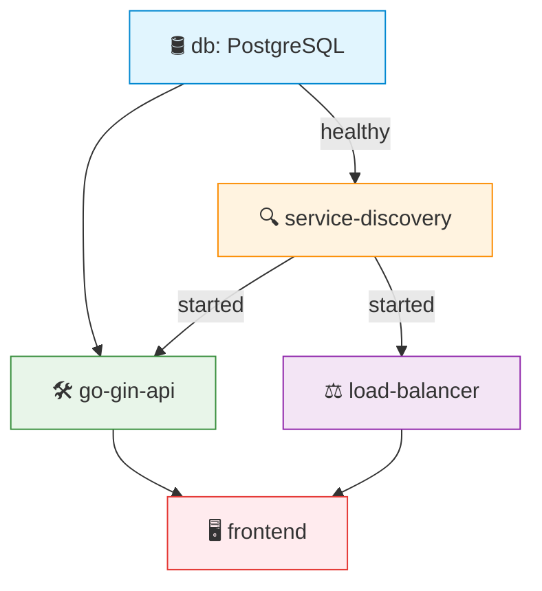

# Go Gin API

API Simples em Go com o intuito de demonstrar o uso com containers

## Autores
- Carolina Martins Emilio - 811508  
- Ivan Capeli Navas - 802286

## Ideia
- Aplicação tem o intuito de ser bem simples
- A ideia é que um usuario teria um nome e um id
- O frontend so precisa mandar um nome para ser cadastrado
- O loadbalancer suporta 2 algoritmos diferentes *roundrobin* e *random*, o default é o *roundrobin* então se tiver o servico na ordem A,B,C o front vai acessar o A, depois o B, depois o C e depois volta para o A.

## Como rodar

```bash
    docker compose up --build
```

### Opcional
Para aproveitar o LoadBalancer o interessante seria rodar com mais de uma instancia da api:
```bash
    docker compose up --build --scale go-gin-api=<numero_de_instancias>
```


## 🚀 Endpoints (LoadBalancer)

- `GET /ping` – health check
- `GET /users` – retorna usuarios
- `POST /users -d {"name": "nomeUsuario"}` – cria um novo usuario
- `OPTIONS /lb/strategy/:strategy` - strategy pode ser *random* ou *roundrobin*

## 🫙 Containers

- **frontend:**  
  Container responsável pela interface gráfica da aplicação.  
  Comunica-se com o *load balancer* para acessar os serviços do backend.  
  Expõe a porta `5000`, permitindo que os usuários acessem o sistema via navegador.

- **go-gin-api:**  
  Backend da aplicação desenvolvido com o framework Go Gin.  
  Processa as requisições enviadas pelo frontend, acessa o banco de dados e interage com outros serviços.  
  Depende do banco de dados estar saudável e do serviço de descoberta estar disponível.

- **db:**  
  Banco de dados PostgreSQL que armazena as informações persistentes da aplicação.  
  Inicializa com um script SQL (`initdb.sql`) e é monitorado com um *healthcheck* para garantir que está pronto antes de os outros serviços dependerem dele.

- **service-discovery:**  
  API de descoberta de serviços.  
  Sua função é registrar os serviços disponíveis e fornecer uma lista atualizada ao *load balancer*, permitindo que ele saiba quais instâncias estão ativas e onde enviar as requisições.

- **load-balancer:**  
  Funciona como um proxy reverso e balanceador de carga.  
  Recebe as requisições do frontend e, com base nas informações do *service discovery*, as distribui entre as instâncias do backend disponíveis, garantindo escalabilidade e alta disponibilidade.
 

## 🔄 Ordem de Inicialização



**Legenda:**  
- 🛢️ `db`: Banco de dados (precisa estar *healthy*)  
- 🔍 `service-discovery`: Pré-requisito para os demais serviços  
- 🛠️ `go-gin-api`: Backend principal  
- ⚖️ `load-balancer`: Balanceador de carga  
- 🖥️ `frontend`: Último a iniciar
