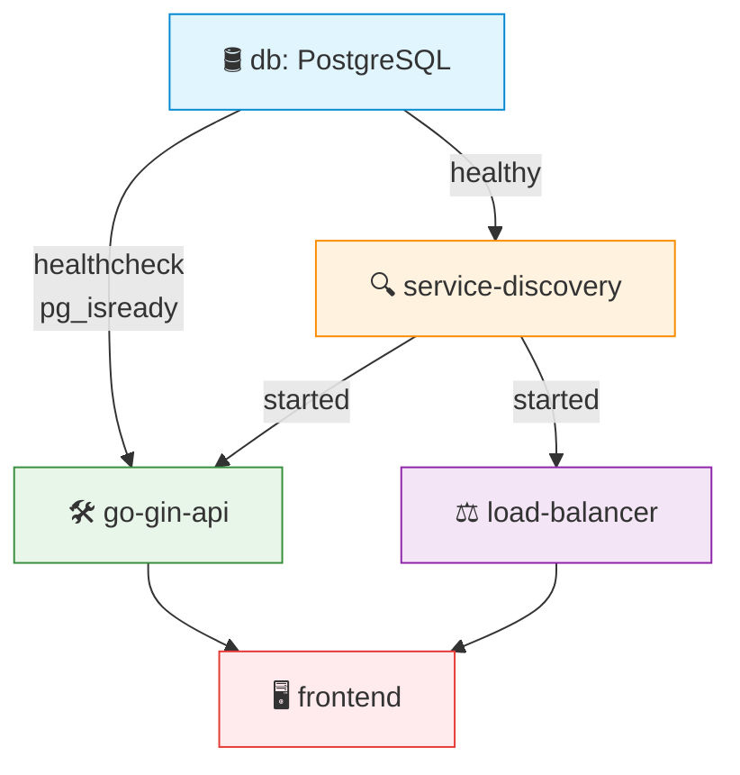

# Go Gin API

API Simples em Go com o intuito de demonstrar o uso com containers

## Autores
- Carolina Martins Emilio - 811508  
- Ivan Capeli Navas - 802286

## Ideia
- Aplicação tem o intuito de ser bem simples
- A ideia é que um usuario teria um nome e um id
- O frontend so precisa mandar um nome para ser cadastrado
- O loadbalancer suporta 2 algoritmos diferentes *roundrobin* e *random*, o default é o *roundrobin* então se tiver o servico na ordem A,B,C o front vai acessar o A, depois o B, depois o C e depois volta para o A.

## Como rodar

```bash
    docker compose up --build
```

### Opcional
Para aproveitar o LoadBalancer o interessante seria rodar com mais de uma instancia da api:
```bash
    docker compose up --build --scale go-gin-api=<numero_de_instancias>
```


## 🚀 Endpoints (LoadBalancer)

- `GET /ping` – health check
- `GET /users` – retorna usuarios
- `POST /users -d {"name": "nomeUsuario"}` – cria um novo usuario
- `OPTIONS /lb/strategy/:strategy` - strategy pode ser *random* ou *roundrobin*

## 🔄 Ordem de Inicialização



**Legenda:**  
- 🛢️ `db`: Banco de dados (precisa estar *healthy*)  
- 🔍 `service-discovery`: Pré-requisito para os demais serviços  
- 🛠️ `go-gin-api`: Backend principal  
- ⚖️ `load-balancer`: Balanceador de carga  
- 🖥️ `frontend`: Último a iniciar