# Go Gin API

Este projeto tem como objetivo aplicar os conceitos de orquestração de contêineres utilizando **Kubernetes** com **Minikube**, a partir de uma aplicação previamente conteinerizada com Docker Compose.

A aplicação é uma **API simples em Go (Gin)** que permite o cadastro e listagem de usuários. Além disso, o sistema possui balanceamento de carga, descoberta de serviços e uma interface gráfica via navegador.

## Autores
- Carolina Martins Emilio - 811508  
- Ivan Capeli Navas - 802286

## Ideia
- Aplicação tem o intuito de ser bem simples
- A ideia é que um usuario teria um nome e um id
- O frontend so precisa mandar um nome para ser cadastrado
- O loadbalancer suporta 2 algoritmos diferentes *roundrobin* e *random*, o default é o *roundrobin* então se tiver o servico na ordem A,B,C o front vai acessar o A, depois o B, depois o C e depois volta para o A.

## Implantação com Kubernetes (Minikube)

A aplicação foi adaptada para execução em **Minikube** com os seguintes objetivos:

- Utilizar **Deployments** e **Services** para os containers.
- Tornar a aplicação acessível via **Ingress** em `http://k8s.local`.
- Automatizar o deploy com **Helm Chart**.


### Estrutura do Helm Chart

```text
charts/
  └── gin-api/
      ├── templates/
      │   ├── deployment-*.yaml
      │   ├── service-*.yaml
      │   ├── ingress.yaml
      │   └── ...
      ├── values.yaml
      └── Chart.yaml
```


## Acesso via Ingress
A aplicação é acessível em:
```text
http://k8s.local
```
## Recursos Kubernetes Utilizados

| Tipo       | Descrição                                                 |
|------------|------------------------------------------------------------|
| Deployment | Define os Pods e réplicas de cada componente              |
| Service    | Exposição interna entre os serviços                       |
| Ingress    | Disponibilização pública do frontend via domínio          |
| ConfigMap  | Variáveis de ambiente                                     |
| Secret     | Armazenamento de dados sensíveis (ex: senha do banco)     |

## Containers

- **frontend:**  
  Container responsável pela interface gráfica da aplicação.  
  Comunica-se com o *load balancer* para acessar os serviços do backend.  
  Expõe a porta `5000`, permitindo que os usuários acessem o sistema via navegador.

- **go-gin-api:**  
  Backend da aplicação desenvolvido com o framework Go Gin.  
  Processa as requisições enviadas pelo frontend, acessa o banco de dados e interage com outros serviços.  
  Depende do banco de dados estar saudável e do serviço de descoberta estar disponível.

- **db:**  
  Banco de dados PostgreSQL que armazena as informações persistentes da aplicação.  
  Inicializa com um script SQL (`initdb.sql`) e é monitorado com um *healthcheck* para garantir que está pronto antes de os outros serviços dependerem dele.

- **service-discovery:**  
  API de descoberta de serviços.  
  Sua função é registrar os serviços disponíveis e fornecer uma lista atualizada ao *load balancer*, permitindo que ele saiba quais instâncias estão ativas e onde enviar as requisições.

- **load-balancer:**  
  Funciona como um proxy reverso e balanceador de carga.  
  Recebe as requisições do frontend e, com base nas informações do *service discovery*, as distribui entre as instâncias do backend disponíveis, garantindo escalabilidade e alta disponibilidade.
 

## 🔄 Ordem de Inicialização

```mermaid
graph TD
    A[🛢️ db: PostgreSQL] --> B[🛠️ go-gin-api]
    A -->|healthy| C[🔍 service-discovery]
    C -->|started| B
    C -->|started| D[⚖️ load-balancer]
    B --> E[🖥️ frontend]
    D --> E
    
    style A fill:#e1f5fe,stroke:#0288d1
    style B fill:#e8f5e9,stroke:#388e3c
    style C fill:#fff3e0,stroke:#fb8c00
    style D fill:#f3e5f5,stroke:#8e24aa
    style E fill:#ffebee,stroke:#e53935
```



**Legenda:**  
- 🛢️ `db`: Banco de dados (precisa estar *healthy*)  
- 🔍 `service-discovery`: Pré-requisito para os demais serviços  
- 🛠️ `go-gin-api`: Backend principal  
- ⚖️ `load-balancer`: Balanceador de carga  
- 🖥️ `frontend`: Último a iniciar

  
